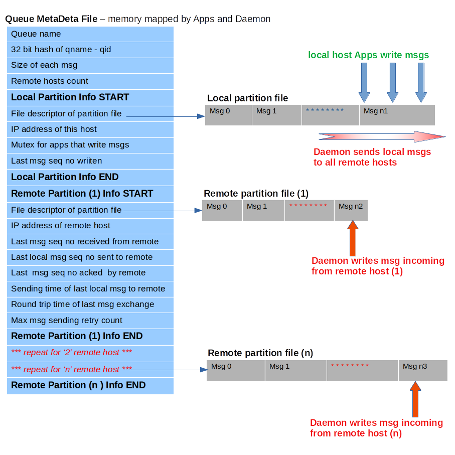

## LUCID Message Queue
lucidMQ is a light weight cluster communication system.
It provides scalable, persistent and fault tolerant message queues across a
cluster of servers.
It's design goals take cognizance of system applications that need fast and
reliable cluster communication while taking server crash and network failures
into consideration.
One could also look at it as a distributed IPC mechanism between applications
across a cluster of servers.

### Key Features
__1. Decoupling of applications from underlying network__
For an application, the communication is file based. Application reads and
writes messages from and to memory mapped  queue partition files on the host.
They need not be aware of underlying cluster network. lucidMQ  makes sure that
messages are available across the cluster asynchronously.
This is specially useful for applications running in different network
namespaces. They can simply bind mount queues directory and communicate across
servers while retaining their network isolation.

__2. Persistence of messages across cluster__
Messages and metadata are persisted to local storage first and then transmitted
to all cluster servers for persistent stoage. Applications can generate and
consume messages in a self-paced manner. Amount of messages is only limited by
available storage on a host.

__3. Fault Tolerance__
Crash of any number of servers does not effect continuity of messaging service
between servers that are still alive. When a crashed server comes back up,
messages that were generated by other servers in the meantime, would be
automatically synced to it. So it can start right where it left.
Also, communication protocol of lucidMQ daemon provides reliable transmission
service on top of UDP, notwithstanding lost messages, duplicates and network
delays.
In effect, message exchanges are stateless allowing for prompt recovery in case
of network partition/failure and (or) server crash.

__4. Scalability__
For systems with page size of 4KB, lucidMQ can support upto 71 servers in a
single cluster. No of message queues supported is unlimited.
lucidMQ makes the assumption that most common MTU size is 1500 and there maybe
overhead of headers for ipsec, gre, vxlan etc.
Thus maximum size of a single message is capped at 1400 bytes.

__5. Library API for applications could be written in any programming language__
For an Application, cluster communication is effectively reading and writing
files. So, writing an interface in Go, Python, Scala, Ruby etc. should be
plain sailing.
C API interface is provided - checkout clientlib folder with 'lucidmq.h'
as interface example and 'lucidmq.c' as library implementation.
Code for 2 basic applications, mqread and mqwrite is also there.
The C interface is similar to POSIX message queue interface.

### Design Notes

####Queue Partition Files
Each message queue consists of a metadata file and variable number of partition
files on each host. Partition files are of 2 types :
1. _Local partition file_ : all messages generated on a host are written to
   this file only. There is only one such file for the queue on each host.

2. _Remote partition file_ : for each remote host, one such file exists locally.
   Messages coming from the remote host are written by the daemon to this file.

The metadata file keeps track of messages written to these partitions.
It is mmaped by daemon and all applications that wish to send and receive
messages from the queue.
Partition files are named as 'qname.ip' whereas metadata file is named as
'qname.meta'. These are stored in storage directory specified to the daemon.
*Refer to struct queue_metadata in lucid.h for finer details*
__Diagram of queue partition files layout :__

####lucidMQ Daemon
Daemon reads the xml configuration file from the storage directory.
It creates queue metadata and partition files if they dont exist.
A lucid controller object is populated with all necessary information.
*Refer to xmlconf.c and initconf.c for finer details*

Sender and receiver threads are launched by daemon for handling queue operations
Daemon listens for SIGTERM and SIGHUP signal for cleanup on exit and
reloading configuration respectively.
*Refer to daemon.c for finer details*

__Sender Thread :__
sender thread takes the care of:
1. sending new msgs to all remote members if local client generates them.
2. retry sending a msg that has not been acked by specific remote member.
3. mark remote members DISCONNECTED and send ping to DISCONNECTED ones.

Sender thread conditionally sleeps for SENDER_TIMEOUT_MS after runnig 1 job
loop. It is woken up by receiver thread from its timed sleep if anyting
is incoming. Pings are not resent for a minimum round trip time. Sender masks
SIGHUP and SIGTERM so that only daemon receives it. Daemon requests
exit upon receiving these signals. Sender obliges.
*Refer to sender.c for finer details*

__Receiver Thread :__
receiver thread takes care of:
1. accept packet from all remote members and process them as per their type.
2. Break  sender thread's timed wait for urgent processing
3. mark remote members CONNECTED upon successful ping acknowledgment.
Receiver thread blocks on socket for incoming msgs. It masks SIGHUP and
SIGTERM so that only daemon receives it. Daemon requests exit upon
receiving these signals. Receiver unblocks after every RECVER_TIMEOUT_MS to
check for such request from daemon for exit.

#### lucidctl tool
this tool is used for dumping any queue's on-disk metadata for live
queue information. Primarily meant for debugging and validation.
*Refer to lucidctl.c for finer details*

#### Synchronization constructs
One pthread condition variable is used by daemon for waking up sender from timed
wait if necessary. A pthread mutex is provided by daemon for client use only.
Since the mutex resides in queue metadata which is mmaped by all clients it
provides synchronization across different writer processes.

Apart from this, rest of the logic uses lock less synchronization via C11
atomic constructs. Changing member state enforces strong memory model while
load and stores work with relaxed memory model for better performance.

Upon msg write, client library syncs metadata page. Also, the local partition
files page range where msg was wriiten is forced to disk. Sync operations
schedule page flush rather than waiting for sync to return. A trade off between
absolute persitence guarantee and performance. Same logic holds for daemon's
receiver thread when a msg from remote host is received.

#### Client library
File based messaging allows for fast message filtering in client library.
Messages could be timestamped upon generation. While reading, they could be
sorted to enable time ordered delivery.
Filters could be implemented for specific use cases too.

#### Deployment
Code is targeted for linux servers not open group standard.
For example, gettimeofday is used freely which linux optimizes via VDSO.
Also, on UNIX systems, mmap API/behaviour might be different.
Use of Atomic constructs require C11 compliant compiler.
lucidMQ network communication works in network byte order (big endian).
So its independent of server hardware.

### Build and Usage
__Build lucidMQ daemon :__
install libxml-2.0 library if its not already there.
run *pkg-config --cflags libxml-2.0* to get include path
run *pkg-config --libs libxml-2.0* to get ld path
*gcc -o lucidd util.c daemon.c initconf.c sender.c receiver.c  xmlconf.c*
                               *-I /usr/include/libxml2/ -lxml2 -pthread*
__Build lucidctl tool :__
*gcc -o lucidctl lucidctl.c*
__Build client applications mqread and mqwrite__
*cd clientlib/*
*gcc -o mqread mqread.c lucidmq.c -pthread*
*gcc -o mqwrite mqwrite.c lucidmq.c -pthread*
__Setup configuration file___
Here's a sample configuration file  lucid.xml:
```
<lucid>
    <storage_dir>/home/kislayakumar/queues</storage_dir>
    <local_member>192.168.100.1</local_member>
    <remote_member>192.168.100.183</remote_member>
    <remote_member>192.168.100.138</remote_member>
    <remote_member>192.168.100.201</remote_member>
    <queue name="testq1" msgsize="8"> </queue>
    <queue name="testq2" msgsize="16"> </queue>
    <queue name="testq3" msgsize="32"> </queue>
    <queue name="testq4" msgsize="64"> </queue>
    <queue name="testq5" msgsize="512"> </queue>
    <queue name="testq6" msgsize="1024"> </queue>
</lucid>
```
All queues will be created in */home/kislayakumar/queues*
For each server host in the cluster set *local_member* to the host's ip. If each
host wants use a different directory you will need to change *storage_dir* for
that host. Here, 6 queues are requested with msg sizes of 8 to 1024 bytes.
__Start the daemon__
*./lucidd -c /home/kislayakumar/queues/lucid.xml -l /home/kislayakumar/queues/log
                                           *-p /home/kislayakumar/queues/pidfile*
Log file could be omitted if you are not debugging the daemon.
__Stop the daemon__
kill -TERM ``cat /home/kislayakumar/queues/pidfile``
__Read Write msgs with client apps mqread and mqwrite__
*cd clientlib/*
*./mqwrite 3 11 8 /home/kislayakumar/queues testq1*
This will write 3 msgs with byte value '11' repeated 8 times into testq1.
8 here is the msg queue size so 11 fills up 8 bytes in the buffer.
These 3 msgs should become available on all remote servers immediately.
Read them with the following on any server:
*./mqread 8 /home/kislayakumar/queues testq1*
__Print queue metadata for any existing queue__
*./lucidctl -p /home/kislayakumar/queues -n testq1*

### Bug Report and Help
Feel free to drop an email in case of issues or interesting ideas around this
project.
e-mail : storagxpert@gmail.com
